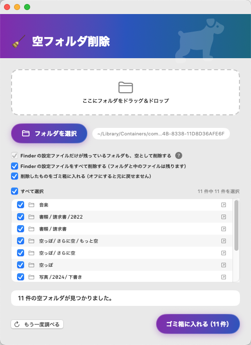

# 空フォルダ削除


散らかったフォルダの中から、**中身が空のフォルダをまとめて片付ける** macOS アプリです。
ターミナルは不要。フォルダをドラッグ＆ドロップするだけで使えます。

`.DS_Store` しか入っていないフォルダも「空」として扱えるので、Finder で見ると空なのに
削除できない、というフォルダもきれいになります。

<p align="center">
  
</p>

上の例では空のフォルダが11件見つかっています。実ファイルの入った「書類」フォルダ自体は
対象に含まれていません。消したくないものはチェックを外せます。

## 特長

- **深い階層も1回で**。削除してできた新しい空フォルダを自動で拾い直すので、
  何度もやり直す必要がありません
- **ゴミ箱に入れる**のが既定の動作。間違えても Finder の「戻す」で復元できます
- 入れ子の空フォルダはまとめて1項目としてゴミ箱に入るので、ゴミ箱が散らかりません
- **一覧で選んでから消せます**。行ごとのチェックボックスで対象を選び、
  右端のボタンでそのフォルダを Finder で開いて中身を確かめられます
- **途中で中止できます**。大きなフォルダでも進み具合が件数で出ます
- シンボリックリンクは辿りません。選んだフォルダの外に出ることはありません
- **パッケージの中には入りません**。`.app`・写真ライブラリ・`.xcodeproj` などは、
  中に空のフォルダがあっても触りません
- **隠しフォルダの中には入りません**。`.git` などの内部構造を壊しません
- App Sandbox 対応。アクセスできるのは、あなたが選んだフォルダだけです

## インストール

[Releases](https://github.com/Ryuuji-sakura/EmptyFolderCleaner/releases) から `.dmg` を
ダウンロードして開き、`空フォルダ削除.app` を `Applications` フォルダにドラッグしてください。

**必要な環境**: macOS 14 (Sonoma) 以降

## 使い方

次のどれかでフォルダを渡すと、すぐにスキャンが始まります。

- ウィンドウにフォルダをドラッグ＆ドロップ
- **Dock アイコンにフォルダをドロップ**
- 「📁 フォルダを選択」ボタンから選ぶ

見つかった空フォルダが一覧で表示されます。既定では全部にチェックが入っているので、
**消したくないものはチェックを外して**から「ゴミ箱に入れる」を押してください。
確認ダイアログが出ます。

行の右端のボタンを押すと、そのフォルダが Finder で開きます。消す前に中身を確かめたいときに。

大きなフォルダを渡したときは「スキャン中... ○○項目」と進み具合が出ます。
時間がかかりすぎるときは「中止」を押してください。

すべてにチェックが入った状態で実行すると、削除してできた新しい空フォルダも続けて
片付けます。一部だけ選んだときは選んだものだけを消し、新しく空になったフォルダは
次の候補として一覧に出します。

### オプション

| 設定 | 既定 | 説明 |
| --- | --- | --- |
| Finderの設定ファイルだけが残っているフォルダも、空として削除する | ON | Finder が勝手に作る `.DS_Store` だけが残っているフォルダを、空として扱います |
| Finderの設定ファイルをすべて削除する | OFF | 中身のあるフォルダの中にある `.DS_Store` も消します。フォルダ自体と中のファイルはそのまま残りますが、そのフォルダの Finder 表示設定はリセットされます |
| 削除したものをゴミ箱に入れる | ON | オフにすると、ゴミ箱を経由せず完全に削除します（**元に戻せません**）。このときは確認ダイアログで Enter キーでは実行できないようにしてあります |

「Finderの設定ファイル」は `.DS_Store` のことです。アプリの中では、はじめて見る人にも
わかるようにこの呼び方をしています。

> **どれを `.DS_Store` とみなすか**
> 同期の衝突で `.DS_Store 12-34-56-789` のように名前が変わったものも対象にしますが、
> 名前だけでは判断しません。ファイルの中身が本当に Finder の作ったものかを確かめるので、
> 自分で `.DS_Store` から始まる名前を付けたファイルが消えることはありません。

> **`.DS_Store` を消すと何が起きる?**
> `.DS_Store` には、そのフォルダを Finder で開いたときの表示設定（ウィンドウの大きさ・位置、
> 表示形式、並び順、アイコンの位置）だけが入っています。フォルダ名やファイルの中身には
> 一切影響しません。次に Finder でそのフォルダを開くと自動的に作り直されます。

## 「空」の判定について

あるフォルダは、**そのフォルダ以下のどこにも実ファイルがない**ときに空とみなされます。
深い階層にファイルが1つでもあれば、その上のフォルダは削除されません。

なお、**あなたが選んだフォルダ自体は削除対象になりません**。消えるのはその中身だけです。

スキャンを途中で中止したときは、それまでに集めた候補をすべて捨てます。まだ見ていない
場所にファイルが残っているかもしれず、「空に見えただけ」のフォルダを消す候補に
するわけにはいかないからです。

## 開発

[XcodeGen](https://github.com/yonaskolb/XcodeGen) で `project.yml` から `.xcodeproj` を生成しています。

```sh
xcodegen generate
xcodebuild -project EmptyFolderCleaner.xcodeproj -scheme EmptyFolderCleaner \
  -configuration Release -derivedDataPath build build
```

テスト（ユニット24件 + UI 5件）:

```sh
xcodebuild -project EmptyFolderCleaner.xcodeproj -scheme EmptyFolderCleaner \
  -configuration Debug -derivedDataPath build test
```

スキャンと削除のロジックは `EmptyFolderCleaner/FolderSweeper.swift` にまとまっていて、
AppKit にも main actor にも依存していないため、実ファイルシステム上で直接テストできます。

`UITests/` は実際のアプリを起動して操作する E2E テストです。LaunchServices 経由で
フォルダを開くことで、サンドボックスの許可が付いた本番同様の状態を作っています。

リリース（Developer ID 署名・公証・staple・検証）:

```sh
./Scripts/release.sh
```

## ライセンス

MIT License — [LICENSE](LICENSE) を参照してください。
